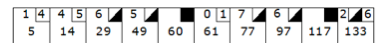

# Testing-wdf-000
 **Rspec.** *What is it good for?*

- Tests check if your work functions as intended.
- Ensure that new features do not break existing functionality.
- Constantly validating that you are writing code that works is essential to the health of your application and your team’s sanity.
- **Rspec Resources**

    http://code.tutsplus.com/articles/rspec-testing-for-beginners-part-1--cms-26716

    http://betterspecs.org

    http://tutorials.jumpstartlab.com/topics/internal_testing/rspec_practices.html

    http://blog.carbonfive.com/2010/10/21/rspec-best-practices/


You've seen a lot of tests. They generally are broken down into 3 phases. *Setup, Trigger, and Expectation*.  Sometimes one or more of these steps will be combined. Sometimes you will need an additional *Breakdown* phase to make sure you are starting fresh on the next test-- you have to clear your database or associations.

Here's a typical example of an Rspec test with the phases labeled:
```ruby
describe '#songs' do
    it 'keeps track of an artist\'s songs' do
      # Setup:
      # make the Song instances you need
      song_one = Song.new("Rock With You")
      song_two = Song.new("Smooth Criminal")

      # Trigger:
      # actually call our method
      # ('artist' comes from a 'let' block defined at the top of the spec.)
      artist.add_song(song_one)
      artist.add_song(song_two)

      # Expectations:
      # confirm that calling your method had the intended results
      expect(artist.songs).to eq([song_one, song_two])
    end
  end
```


## The Rules of Bowling ##




A game of 10-pin bowling consists of 10 frames in which the player attempts to knock down as many pins as possible.  Each frame is made up of 2 rolls.  Generally, the player is awarded one point for every pin knocked down. A **gutter ball** is the term for a roll in which 0 pins were knocked down.

A **spare** is when a player knocks down all 10 pins across the two rolls that make up a frame (i.e. on the first roll 7 pins were knocked down and on the second roll the remaining 3 pins were knocked down).  When a player rolls a **spare** they receive bonus points.  The number of bonus points is the number of pins knocked down on the *next* roll.

A **strike** is when the player knocks down all 10 pins on the first try.  The bonus points for a strike are the number of pins knocked down on the next *two* rolls.

In the final frame (the tenth frame), if a player rolls a strike or a spare they are awarded a bonus roll. No more than 3 rolls can be bowled in the tenth frame.

## Your Task ##


Write a class `Game` that has (at least) two methods: `#roll` and `#score`.

`#roll` should take an argument of the number of pins knocked down on that roll.
*`roll(0)` for example, would be the method call for a gutter ball.*

`#score` should be called once at the end of the game. It should return the score for that game.

Your task will also include writing the specs for this code.  Use the resources above to figure out how to setup your project with rspec and familiarize yourself with the rspec syntax.

### Testing Requirements ###

Your job is to write an implementation of the `Game` class that can pass these tests in this order.  You should write each test and then write the code that will make the test pass.  When the test passes you should move on to the next test. Write the test, make it pass, repeat. Ensure that previous tests don't break when trying to pass the next test.

*Do not try to over-implement! Don't be worrying about strike functionality when trying to pass Test 1. Focus on passing the current test with the minimum amount of struggle, this is **Test Driven Development.*** *The tests will drive your implementation forward.*  


**Test 0**
- Should be able to create a new instance of the `Game` class.

**Test 1**
- Can roll a gutter game.
- A game of all 0's should score 0 ( `game.score` should return `0`).

**Test 2**
- Should be able to score a game without strikes or spares.
- The player rolls all 1's
- The score should be 20.

**Test 3**
- Can roll a spare.
- The player rolls two 5's, then a 3, then all gutter balls.
- The score should be 16.

**Test 4**
- Can roll a strike.
- The player rolls a strike, then a 3 and a 4, then all gutter balls.
- The score should be 24

**Test 5**
- Can roll a perfect game.
- The player throws 12 stikes.
- The score should be 300.
